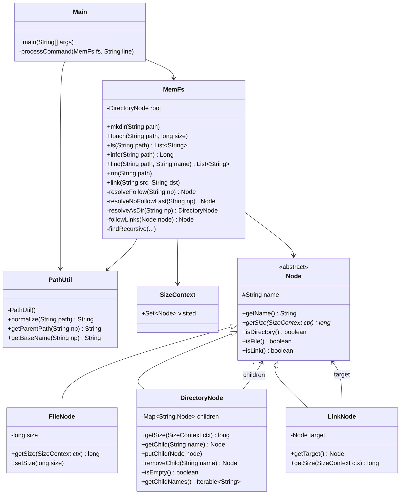

# 系统架构设计文档

## 小组信息

- **Gradescope 账号 name**：张家浩
- **Gradescope 账号邮箱**：231250158@smail.nju.edu.cn
- **组员**：
  - 张家浩 231250158
  - 张屹峰 231250116
  - 华振翔 231250194
  - 王涵 231250183

## 系统目标与范围

本程序实现一个**微型内存文件系统**，从标准输入读取命令，在内存中维护文件树结构，通过标准输出返回查询结果。

**支持的命令集合**

| 命令 | 功能 |
|------|------|
| `MKDIR <path>` | 创建目录 |
| `TOUCH <path> <size>` | 创建/覆盖文件 |
| `LS <path>` | 列出子节点（目录）或节点名称（文件） |
| `INFO <path>` | 查询节点大小（目录递归求和、去重） |
| `FIND <path> <name>` | 递归搜索匹配名称的节点 |
| `RM <path>` | 删除文件/空目录/链接 |
| `LINK <src> <dst>` | 创建指向已有节点的链接 |

**数据模型**：文件（File）、目录（Directory）、链接（Link）三类节点。链接采用「共享底层节点」语义，多个链接可指向同一节点。

**路径规范化**：支持冗余 `/`（`//`）、`.`（当前目录）、`..`（父目录）、尾斜杠；根目录的 `..` 仍为根目录。

## 核心架构

系统分为四个核心模块：命令分发层、路径规范化模块、文件系统核心、节点抽象层。

**模块职责：**

- **Main / Command Dispatcher**：读取 stdin，按空白符解析命令名和参数，分发到 MemFs 的对应方法。未知命令、参数不足、非法数值均静默忽略。
- **PathUtil**：无状态的工具类，负责路径规范化（合并 `//`、解析 `.` 和 `..`、去除尾斜杠）以及父路径/基名提取。对非绝对路径返回 `null`，由调用方忽略。
- **MemFs**：文件系统核心，持有根目录引用。提供 7 个公开命令方法，内部封装路径解析、链接跟随、递归搜索等逻辑。
- **Node 体系**：`Node` 为抽象基类，`FileNode`、`DirectoryNode`、`LinkNode` 分别实现。`getSize(SizeContext)` 是核心的多态方法，通过传入 `SizeContext` 实现去重。
- **SizeContext**：携带 `visited` 集合的上下文对象，在 `INFO` 的递归统计中追踪已计数的节点，防止链接导致的重复计数。

## 关键数据结构

### 目录与子节点管理

`DirectoryNode` 内部使用 `TreeMap<String, Node>` 存储子节点，以节点名称为键，天然保证 `LS` 和 `FIND` 输出时的字典序。例如根目录下 `usr` 映射到一个 `DirectoryNode`，其内部又通过 `TreeMap` 管理 `local`、`b.txt` 等子节点，形成递归的树状结构。

### 链接与底层节点共享

`LinkNode` 直接持有目标 `Node` 的 Java 引用（`target` 字段），多个 `LinkNode` 可指向同一个底层节点，实现「共享底层节点」语义。系统不为底层节点分配唯一标识——节点对象的 Java 引用本身即为唯一标识，`SizeContext.visited`（`HashSet<Node>`）依据引用相等性去重，确保同一底层文件或目录在 `INFO` 统计中只计算一次。

### 目录项名称 vs 被链接目标节点

`LinkNode` 本身有独立的 `name`（目录项名称），在 `LS` 和 `FIND` 中以其自身名称参与匹配与输出；但 `getSize` 方法直接委托给 `target.getSize(ctx)`，使 `INFO` 统计大小时按底层节点去重，而非按目录项去重。例如 `/alias`（LinkNode, name="alias"）指向 `/usr/local`（DirectoryNode, name="local"）时，`LS /alias` 输出链接自身名称 `alias`（当目标为文件时）或列出目标目录的子节点，而 `INFO /alias` 返回的是 `/usr/local` 的递归大小。

### 文件大小保存位置

文件大小保存在 `FileNode` 的私有字段 `long size` 中。创建文件时由 `TOUCH` 命令传入，覆盖已有文件时通过 `setSize(long)` 更新该字段。查询时由 `getSize(SizeContext ctx)` 返回，`ctx` 参数用于去重（首次访问将该 `FileNode` 加入 visited，再次访问返回 0），但在无链接的简单场景下 `size` 字段的值即为最终返回值。

### 是否为底层节点分配唯一标识

不为底层节点分配额外的唯一标识。Java 对象的引用本身即为天然的唯一标识——`SizeContext.visited` 使用 `HashSet<Node>`，依据 `hashCode` 和 `equals` 的默认实现（引用相等）判断节点是否已被访问。`FIND` 的 `expanded` 集合同理。这种方式无需为每个节点生成 ID，且能保证同一底层目录或文件无论通过多少条链接路径抵达，在 `HashSet` 中都被识别为同一个节点。

## 关键算法与边界处理

### 路径规范化

`PathUtil.normalize()` 首先检查路径是否以 `/` 开头，非绝对路径直接返回 `null`。然后按 `/` 切分路径，用一个栈逐段处理：空串（来自冗余 `//` 或尾斜杠）和 `.` 直接跳过；`..` 弹出栈顶元素（栈空时无操作，即根目录的父目录仍为根目录）；普通名称入栈。最终将栈内元素以 `/` 连接，栈空时返回 `/`。例如 `"/a//b/./c/../"` 经处理后得到 `"/a/b"`。

### INFO 去重机制

`INFO` 命令通过 `new SizeContext()` 创建带空白 `visited` 集合的上下文，传入节点的 `getSize(ctx)` 方法。`FileNode` 和 `DirectoryNode` 在计算前均调用 `ctx.visited.add(this)`，若节点已存在于集合中（返回 `false`）则直接返回 0，避免重复计数。`LinkNode.getSize(ctx)` 直接委托给 `target.getSize(ctx)`，底层节点的去重检查自然生效。例如 `/data` 目录含两个文件共 30，`/alias` 链接指向 `/data`，统计根目录大小时 `/data` 首次进入被计数为 30，`/alias` 跟随链接再次到达 `/data` 时因已被 visited 记录而返回 0，最终结果为 30。

### FIND 递归搜索与去重展开

`FIND` 从指定路径开始，首先检查当前节点名称是否匹配搜索名，若匹配则将绝对路径加入结果集。然后跟随链接得到实际目标节点；若目标是 `DirectoryNode`，则检查其是否已在 `expanded` 集合中——已展开则跳过，未展开则加入集合并递归处理子节点。处理子节点时先将非 `LinkNode` 子节点优先递归，再将 `LinkNode` 子节点延后递归，确保权威路径（如 `/usr/local/a.txt`）在链接路径（如 `/alias/a.txt`）之前被发现和展开。所有结果最终按字典序排序输出。

### RM 删除规则

`RM` 首先规范化和解析路径（使用 `resolveNoFollowLast`，不跟随最终链接），若路径不存在或为根目录则忽略。对于 `FileNode` 和 `LinkNode`，直接从父目录中移除——删除链接只删除链接条目本身，不影响被指向的目标节点。对于 `DirectoryNode`（非链接），仅在目录为空（`children.isEmpty()`）时允许删除，非空目录则忽略该命令。

### 覆盖语义

目标路径不存在时，`MKDIR` 创建目录、`TOUCH` 创建文件。目标路径已存在时：`MKDIR` 遇到文件或链接则用新 `DirectoryNode` 替换，遇到非链接目录则保持不变；`TOUCH` 遇到已存在文件则调用 `setSize` 覆盖大小，遇到目录或链接则用新 `FileNode` 替换该目录项。此外 `LINK` 的 `<dstAbsPath>` 若已存在节点，同样用新 `LinkNode` 覆盖替换。所有替换操作均通过 `DirectoryNode.putChild()` 完成，该方法直接覆盖 `TreeMap` 中的同名条目。

### 非法操作统一忽略

所有非法命令或失败操作均**静默忽略**，不输出任何内容，不改变文件系统状态：

- 命令名不在 {MKDIR, TOUCH, LS, INFO, FIND, RM, LINK} 中
- 参数数量不足
- 路径不是绝对路径（不以 `/` 开头）
- 路径规范化为 null
- 父目录不存在或不是目录
- TOUCH 的 size 不是非负整数
- 对不存在的路径执行 LS / INFO / FIND / RM
- 删除非空目录
- 对根目录 `/` 执行 MKDIR / TOUCH / RM / LINK（作为目标）

## 测试说明

我们针对以下场景开展了测试，均已通过本地测试，且 Gradescope 上两次测试均为满分。

| 测试场景 | 覆盖内容 |
|----------|----------|
| 基础创建与查询 | MKDIR/TOUCH 创建节点，LS 列目录/文件，INFO 查大小 |
| 覆盖语义 | TOUCH 覆盖文件大小、替换目录；MKDIR 替换文件；链接被替换 |
| 路径规范化 | `//`、`.`、`..`、尾斜杠；根目录 `..` 行为；非绝对路径忽略 |
| 删除操作 | 删除文件、删除空目录、拒绝删除非空目录、删除链接不影响目标 |
| FIND 递归搜索 | 目录子树递归查找、从文件起点查找、无匹配不输出 |
| 链接到文件 | INFO 返回目标大小、LS 输出链接自身名称 |
| 链接到目录 | LS 列出目标目录子节点、TOUCH 通过链接创建文件、FIND 进入链接目录 |
| INFO 去重 | 多链接指向同一目录时不重复计数、链接链的正确解析 |
| 非法输入 | 负数 TOUCH、不存在路径的 LS/INFO/FIND/RM、未知命令、多余空白符 |
| 综合场景 | README-2.md 第 6 节完整示例，涵盖规范化+链接+去重+删除 |
